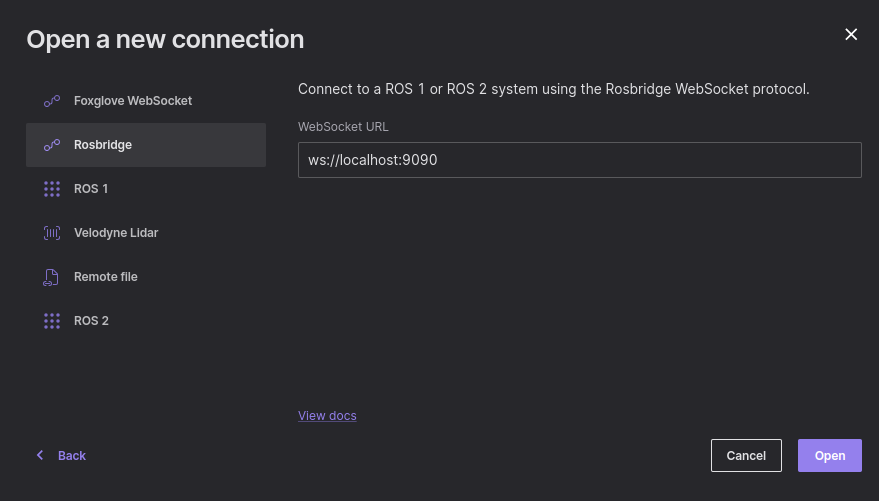

# General Information

This is a ROS simulation of soft landing of an object.
In the ROS system we have two nodes: the first represents the dynamics and the second one is the controller.


## System Dynamics
The system's equation of motion is the kinematic equation of a free body fall:

$$ v = \int \left ( u-g \right )dt +v_0 $$


$$ r = \int \left ( v \right )dt +r_0 $$

when `u` is the controller fedback , `g` is the gravity vector `r0` , `v0` is the initial conditions of the object.


## The Controller
Because we simulate a soft landing, we want that our object to land with the minimum velocity ($\overrightarrow{V_f}$ --> 0) at the landing point that we want.  
The controller is based on this paper:

*S. Gutman, "Rendezvous and Soft Landing in Closed Form via LQ Optimization," 2019 27th Mediterranean Conference on Control and Automation (MED), Akko, Israel, 2019, pp. 536-540, doi: 10.1109/MED.2019.8798572.*


# Installation
 Clone the repository from Github:
   ```sh
   	git clone git@github.com:citros-garden/soft_landing.git
   ```
Then open the repository in VSCode's `devcontainer` with `reopen in container option`.


# Build

Use predefined [VSCode tasks](.vscode/tasks.json) to build.  
Run by typing `ctrl+p`,in the drop-down menu type `task build`  and then click on the `enter` button.

Also, you can do it manually by writing in the terminal of VSCode:

```sh
	colcon build
	source install/local_setup.bash
```

# Run
Run the example of an object with the initial condition: 

$$\overrightarrow{r_0} =[2000,1000,4000][m]$$

$$\overrightarrow{v_0} = [5,5,5] [m/s]$$

And the goal is to land in the point:

$$u_0=[0,0,0]$$ 

On the moon,so to gravity is: $\overrightarrow{g}=[0,0,1.62] [m/sec^2]$.

Use predefined [VSCode tasks](.vscode/tasks.json) to run by typing `ctrl+p`, in the drop-down menu type `task run`  and then click on the `enter` button.

Note that you can run the launch file manually by writing in the terminal of VSCode:

```sh
	ros2 launch dynamics dynamics_controller.launch.py
```

# Develop
You are welcome to enhance the simulation by following the instructions provided in [this](https://github.com/citros-garden/.github/blob/main/contribute.md) guide.  


# Foxglove Visualization
[FoxGlove](https://foxglove.dev/) Studio is a tool used for robotics visualization and debugging. It is capable of connecting to ROS 2 topics and retrieving the data published through them. With FoxGlove, we can view a graphical representation of the simulation.

To add a data source in FoxGlove, you need to follow these steps:  
first, click on `Open Connection` and choose `Rosbridge`. Then, enter the URL "ws://localhost:9090" and click on `Open`.



Next, you need to load the soft landing layout. To do this, go to the Layout tab on the top panel, and click on the `Import Layout From File` button. Select the file `soft landing layout.json` from the `foxglove_layouts` folder.

Finally, [Run](#run) the simulation to view the graphs on Foxglove.